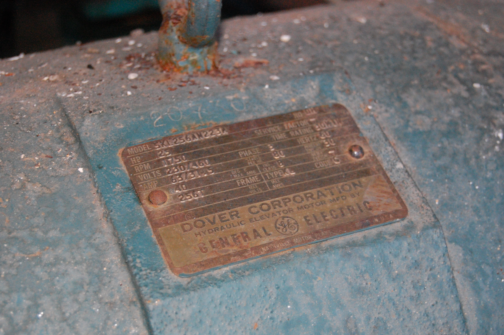

# Confluence Custom Document Enrichment

## Getting started
Here are the steps to running these Lambda Functions for Confluence CDE

1. In your AWS Account, create an Amazon Q application with confluence as the data source. 
2. Create an Amazon Simple Storage Service (Amazon S3) bucket to use as a data source to store your text files. 
3. Create an Service role for Lambda - This service role provides the lambda the permissions to read and write to the CDE S3 bucket, update the datasource of Amazon Q Business, and then call the model using Bedrock API.  Refer to https://docs.aws.amazon.com/IAM/latest/UserGuide/id_roles_create_for-service.html for more information. When creating the service role select Lambda as service and for the Permissions policies see the LambdaRolePolicy file.
4. Create the preExtraction Lambda function and select the Lambda service role you created earlier as the execution role. When creating the Lambda function for Runtime, choose Python 3.12. Use the PreExtractionLambda code for the function code of the preExtraction function.
5. Click on the Configuration table and select the Environment variables to fill in    your Confluence authentication credentials 
6. Create the postExtraction Lambda function and select the Lambda service role you created earlier as the execution role as you did in step 4. When creating the Lambda function for Runtime, choose Python 3.12. Use the PostExtraction code for the function code of the postExtraction function.
Download a sample image file   to a local drive on your computer. It is a image file in JPG format, and contains a hydraulic elevator motor with a label on top.
7. Open your confluence account via Atlassian
8. In the left navigation pane, choose Confluence.
9. In the top, click the Spaces tab and select Create a space
10. Also in the left navigation pane, select Create and choose page to create a page.
11. In the page you just created upload the image file you downloaded earlier and click on Publish and the top right panel.
12. Copy the page number and paste it on line 151 in the Lambda handler function of the preExtraction Lambda function.
13. After file upload is successfully finished, navigate to Amazon Q Business service in the navigation pane.
14. Choose Document enrichment in the navigation pane, and choose Add document enrichment.
15. For Data Source ID, select the Confluence data source you setup before in the App.
16. Enter one basic operation rule as shown in the following figure to add metadata _category to uploaded image file in confluence page. Select _source_uri under Document field name, select Contains under Conditional operator, type in {"stringValue":"Image"} as Condtional value. Select _category under Index field name, type in {"stringValue":"image_file"} as Target value, select Update under Target action.
17. Choose Next to configure PreExtraction Lambda function.
18. On the Configure Lambda functions page, in the Lambda for pre-extraction section, First, Select _source_uri under Document field name, select Contains under Conditional operator, type in {"stringValue":"Image"} as Condtional value. Next, fill in PreExtraction Lambda function ARN and Amazon CDES3BucketName for CDE as shown from the previous step. For Service permissions, choose Enter custom role ARN and enter the CDELambdaRolename create earlier. This is a role policy to allow Amazon Q to run PreExtractionHookConfiguration.
19.    For PostExtraction Lmabda function, first Select _source_uri under Document field name, select Contains under Conditional operator, type in {"stringValue":"Image"} as Condtional value. Next, fill in PostExtraction Lambda function ARN and Amazon CDES3BucketName for CDE as sown from the previous step. You can use the same CDELambdaRolename as you used for PreExtraction Lambda.
20. Choose Next.
21. Review all the information and choose Add document enrichment.
22. Click the Data sources on the right navigation pane and choose the S3 data source and select Edit.
23. Add “pre-extraction/” to Exclude Patterns, under Filter Patterns, and click Add. Then add “post-extraction/” to Exclude Patterns too.
24. Change the sync mode from Full to New, modified or Deleted content sync, and click Update.
25. Navigate back to Amazon Q Application console select the Confluence data source, and choose Sync to start data source sync.
26. The data source sync can take up to 10–15 minutes to complete.
27. Browse back to the data source page and wait for the sync to complete. Once the sync is finished, the run history will show Completed status.
28. Do same for S3 data source. Choose sync to start data source sync for S3
29. After the index sync is finished, you can click on Amazon Q Business App to test the PreExtraction CDE